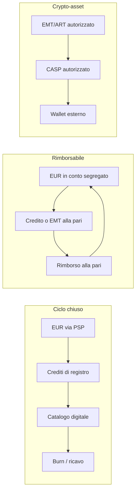

# Architettura di monetizzazione — Zecca

Analisi tecnica e concettuale. **Non è parere legale, fiscale o di vigilanza.** Prima di offrire al pubblico crediti rimborsabili, token o prelievi servono avvocato regolamentare e commercialista.

## Verdetto

Le quattro direttrici (emissione interna, crediti d’acquisto, convertibilità, off-ramp) **non stanno insieme** se l’emissione è elastica e illimitata.

| Combinazione | Fattibile | Regime tipico (UE, 2026) |
| --- | --- | --- |
| Crediti solo spendibili in catalogo, **non** rimborsabili | Sì | Commercio / buono d’acquisto. Zecca oggi, se si spegne la fusione. |
| Crediti rimborsabili in EUR, conio **solo** a fronte di fiat incassato (rapporto riserve ≥ 100%) | Sì, con licenza | Moneta elettronica (IMEL) e/o servizio di pagamento. |
| Token on-chain ancorato all’euro, rimborsabile alla pari | Sì, con autorizzazione | MiCA: *e-money token* (EMT). Emittente: istituto di credito o IMEL. |
| Token on-chain con riserva mista / paniere | Sì, con autorizzazione | MiCA: *asset-referenced token* (ART). Riserva segregata, white paper, fondi propri. |
| **Conio illimitato + prelievo EUR o crypto** | No | Iperemissione: passività > cassa. Insolvenza e, in UE, attività riservata senza copertura. |

Zecca in questo repository è un **libro mastro chiuso** (pockets `VOID → TREASURY → USER → ESCROW → BURN`). Non è una blockchain e non è una banca. Il bonifico SEPA resta manuale. L’invio crypto EVM, se `ZECCA_EVM_PRIVATE_KEY` è impostata e il wallet è finanziato, parte dal negozio: chi riceve non firma.

## Tre oggetti diversi (non mescolarli)



1. **Unità contabile interna** — riga di database. È quello che Zecca già fa (`LedgerEntry`).
2. **Moneta elettronica / buono rimborsabile** — credito che il cliente può ritirare in euro. In UE è attività riservata.
3. **Crypto-asset** — valore trasferibile su registro distribuito. In UE cade sotto MiCA (Reg. 2023/1114). Dal 1º luglio 2026 i CASP senza autorizzazione non possono più operare nel transitorio nazionale.

Un ERC-20 non “fa” la zecca: sposta il problema su un altro registro e **alza** il carico normativo.

## Architettura logica raccomandata (sostenibile)

Regola unica: **non si conia passività verso i clienti senza un euro (o un EMT autorizzato) già incassato e segregato.**

```
[Cliente] --carta/SEPA--> [PSP licenziato: Stripe/Adyen]
                              |
                              v
                    [Conto operativo / segregato]
                              |
                    mint 1:1  v
                    [Libro mastro Zecca]
                         |            |
                    spend in        richiesta
                    catalogo        di fusione
                         |            |
                       burn      solo se riserva >= importo
                                      |
                                      v
                               [SEPA dal conto reale]
                               oppure CASP per USDC/EURC
```

Corrispondenza con il codice attuale:

| Funzione | Oggi | Per un sistema coperto |
| --- | --- | --- |
| Emissione | `mintCredits` / `ensureTreasury` (conio anche a vuoto) | Mint **solo** nel webhook Stripe (`purchaseCredits` method `stripe`) |
| Riserva | Tesoreria mostra conio, non copertura | `getReserveReport()`: euro Stripe / passività da circolante |
| Spenda | `placeOrder` brucia crediti | Invariato (è il burn sano) |
| Off-ramp EUR | Coda Fusioni + SEPA manuale | Stesso flusso, **bloccato** se `reserveRatio < 1` |
| Off-ramp crypto | Non c’è e **non va aggiunto** su conio scoperto | Solo tramite CASP autorizzato, dopo EMT/ART |

### Smart contract (solo se si esce dal ciclo chiuso)

Standard: **ERC-20** (o equivalente su L2: Base, Arbitrum, Polygon) con ruoli, non un mint libero del `owner`.

| Ruolo | Chi | Cosa fa |
| --- | --- | --- |
| `MINTER` | Backend dopo webhook fiat **regolato** | `mint(to, amount)` = fondi ricevuti / par |
| `BURNER` | Backend su rimborso o spesa on-chain | `burnFrom` |
| `PAUSER` | Governance / compliance | Ferma trasferimenti in incidente |
| Nessun `owner.mint` illimitato | — | Incompatibile con EMT/ART |

Ancoraggio:

- **EMT** (es. riferimento EUR): emissione alla pari **dopo** ricezione fondi; rimborso alla pari a richiesta; riserva in depositi e strumenti liquidi (MiCA Titolo IV; per ART/EMT significativi si applicano anche i requisiti di liquidità art. 36).
- **ART**: riserva di attività a copertura delle passività, segregata, con quote minime a scadenza giornaliera/settimanale e depositi nella valuta di riferimento (orientativamente ≥ 30% in depositi per ART non significativi, soglie più alte se significativi — RTS EBA art. 36).
- **Utility token** (licenza software): può evitare ART/EMT **solo** se non è mezzo di scambio/rimborso. Un off-ramp verso USDC o IBAN lo fa uscire da questa nicchia.

Non si consiglia un token “della casa” flottante oltre all’unità da 1 cr = 1 EUR: doppia unità senza mercato ufficiale è un cambio interno opaco (e, se rimborsabile, ancora e-money).

## Gateway e on/off-ramp

### Fiat → crediti (on-ramp)

Già nel repo: Stripe Checkout + webhook `checkout.session.completed`.

| Provider | Uso |
| --- | --- |
| Stripe / Adyen / Mollie | Carte e, dove disponibile, bonifici. KYC del merchant. |
| Stripe Identity, Onfido, Sumsub | KYC clienti se i volumi o il rimborso lo richiedono (AML). |

Il PSP **non** vi rende IMEL. Incassa per voi; se rimborsate i crediti, la qualificazione resta vostra.

### Crediti → EUR (off-ramp tradizionale)

Non automatizzare con un “motore interno”. Flusso corretto: coda Fusioni → bonifico dal conto intestato all’emittente → `CASHOUT_PAID` sul libro. Provider bancario: il conto dell’impresa, non un IBAN in chat.

Soglia operativa: pagare **solo** se `stripeEurCents - eurOut >= importo` (riserva vera, non conio).

### Crediti → crypto (off-ramp)

Solo **dopo** regime EMT/ART + CASP. Esempi di categoria (sceglie il legale, non il codice):

- On/off-ramp licenziati (es. Ramp Network, MoonPay) per comprare USDC/EURC **con i fondi già in cassa**.
- Custodia istituzionale (Fireblocks o equivalente) se detenete crypto di riserva.
- Travel Rule (trasferimenti verso wallet non ospitati sopra le soglie UE).

Non: nodi propri che “inviano ETH al cliente” in base al conio interno; mixer; chain opache per eludere KYC.

## Rischi sistemici e sostenibilità

### Iperinflazione da coniazione illimitata

Sia `M` il circolante (portafogli + escrow), `R` gli euro **veramente** incassati e non ancora rimborsati, `p` il tasso (oggi 1 cr = 1 EUR).

Copertura = `R / (M × p)`.

- Se mintate 2×10⁹ cr senza Stripe, `R ≈ 0` e `M` sale appena quei crediti sono venduti o regalati. Copertura → 0.
- La **Forgia** limita il rimborso giornaliero, non la passività: è un freno di liquidità, non una riserva.
- `ensureTreasury` (conio automatico sulle vendite) è lecito **solo** come anticipo di magazzino interno. Diventa insostenibile se quei crediti sono poi rimborsabili.

In tesoreria il rapporto è calcolato da `getReserveReport()`: euro da acquisti `method=stripe` sul circolante. Gli acquisti demo **non** contano come riserva.

### Gestione delle riserve

Obiettivo di un modello rimborsabile: **ratio ≥ 100% in ogni momento**, con:

- conto segregato (fondi clienti ≠ spese operative);
- riconciliazione giornaliera libro mastro ↔ estratto conto;
- freeze delle fusioni se il ratio scende sotto 1;
- divieto di mint verso `USER` senza riga `PURCHASE_CREDITS` Stripe (o SEPA riconciliata).

Tesoreria piena di crediti **non emessi** (pocket `TREASURY`) non è riserva: è inventario. La passività nasce quando il credito è nel portafoglio del cliente.

### Conformità (quadro, non checklist esaustiva)

- **AML / 5–6AMLD** e norme antiriciclaggio italiane: identificazione, titolare effettivo, monitoraggio, SOS. Obbligo pieno se siete ente obbligato (IMEL, prestatore di servizi, CASP).
- **MiCA**: offerta al pubblico di crypto-asset, ART, EMT, servizi CASP (custodia, scambio, trasferimento). Fondi propri CASP a scaglioni (indicativamente 50k–150k EUR più overhead). EMT: emissione/rimborso alla pari; in UE emittente = banca o IMEL.
- **Direttiva moneta elettronica (2009/110/CE)** e TUB: crediti rimborsabili in euro, anche solo su registro privato, possono essere moneta elettronica.
- **PSD2**: se muovete fondi di terzi come servizio di pagamento.
- **Consumatori, privacy (GDPR), fisco**: IVA su licenze/servizi; i crediti non sono corso legale.

Un sito che dice “non siamo una banca” **non** esclude la qualificazione se il comportamento è rimborso alla pari.

## Cosa questo repo implementa — e cosa no

Implementato: libro mastro, conio, acquisto (demo/Stripe), bottega, forgia, prelievo clienti verso **IBAN o wallet**, invio EVM dal wallet del negozio se configurato, **indicatore di copertura** in Tesoreria, questa nota.

Non verrà implementato qui:

- smart contract ERC-20 con mint libero;
- bonifico SEPA automatico da UniCredit/Wise;
- trasformazione del conio scoperto in un prelievo automatico fiat.

Quella strada è un prodotto regolamentato, con capitale, riserve e autorizzazione — non un’estensione di `ensureTreasury`.

## Sequenza operativa se si vuole “il vero”

1. Decidere il regime con un legale: ciclo chiuso **oppure** IMEL **oppure** EMT.
2. Spegnere il conio a vuoto per qualunque credito rimborsabile.
3. Stripe live + conto segregato + KYC commisurato.
4. Fusioni solo a copertura ≥ 100%.
5. Solo allora, eventuale CASP per crypto, su fondi già in riserva.

Fino ad allora Zecca resta una bottega con registro: utile per catalogo e fedeltà giornaliera, non un emittente di liquidità esterna.
