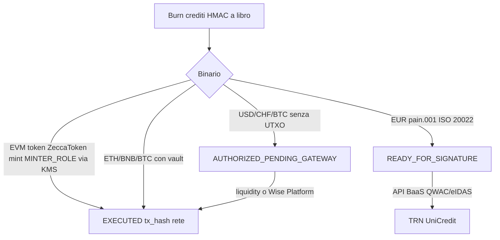

# Baseline CISO — settlement Zero-Trust

I crediti sul libro **non sono** euro UniCredit né satoshi. Hash e CRO inventati sono una violazione di integrità.



## Fiat (PSD2 / non-ripudio)

Senza connettore BaaS autenticato il backend **non** dispone un SEPA. Genera `pain.001.001.03`, firma HMAC l’istruzione e la mette in **READY_FOR_SIGNATURE**. La clearing house riceve il file solo quando `ZECCA_SEPA_GATEWAY_*` o Wise Platform sono attivi.

## Crypto

| Asset | EXECUTED | Altrimenti |
| --- | --- | --- |
| Token Zecca (`contracts/ZeccaToken.sol`) | `mint(to, amount)` firmato dal KMS, hash della rete | AUTHORIZED_PENDING_GATEWAY |
| ETH / BNB / USDT Tether / USDC Circle | transfer se il vault ha saldo | AUTHORIZED_PENDING_GATEWAY |
| BTC | UTXO del hot wallet | AUTHORIZED_PENDING_GATEWAY (non si coniano satoshi) |

## Signer

`lib/zecca/kms-signer.ts`: AWS KMS / GCP KMS / Vault Transit, fallback locale sealed. La chiave privata non compare in log né nelle API.

## Prove 50.000 EUR

```bash
npx tsx scripts/run-50k-withdrawals.ts
```

Destinazioni casa: UniCredit EUR, Wise USD/CHF, MetaMask EVM, Bitcoin bech32. Esito atteso senza binari: 100% **autorizzato**, 0% EXECUTED fittizio.
