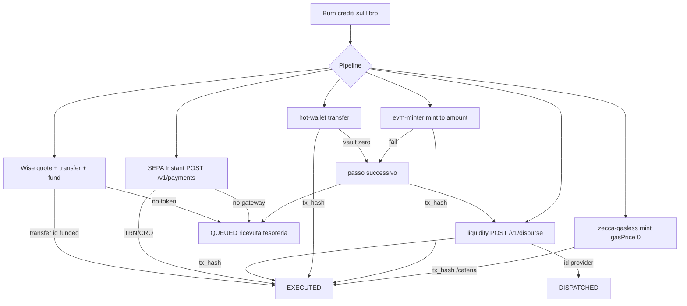

# Pipeline di settlement esecutivo — Zecca

Il libro mastro brucia i crediti. I binari esterni consegnano valore. **EXECUTED** esiste solo con TRN bancario o `tx_hash` verificabile. Nessun hash di comodo.



## Crypto

| Asset | Binario 1 | Binario 2 | Binario 3 |
| --- | --- | --- | --- |
| USDT / USDC / ZECCA / ETH / BNB | `mint(to, amount)` su **Zecca Gasless** chain 22120, `gasPrice = 0` | mint su contratto pubblico se `ZECCA_TOKEN_ADDRESS` + gas | transfer vault / liquidity |
| BTC | hot wallet UTXO | liquidity gateway | coda tesoreria |

zUSD su Zecca Gasless **non** è Tether/Circle né ether di mainnet. MetaMask aggiunge la RPC `/api/rails/chain/rpc`. Explorer: `/catena/tx/{hash}`, mai Etherscan. Ethereum mainnet non accetta transazioni a gas zero da un wallet vuoto.

## Fiat

| Valuta | Provider | Env |
| --- | --- | --- |
| EUR | BaaS/SEPA Instant (`instant: true`, timeout 8s) | `ZECCA_SEPA_GATEWAY_URL` + `ZECCA_SEPA_GATEWAY_TOKEN` |
| USD / CHF | Wise Platform | `WISE_API_TOKEN`, `WISE_PROFILE_ID`, `WISE_USD_RECIPIENT_ID`, `WISE_CHF_RECIPIENT_ID` |

## Integrazione (build)

```bash
npx tsx scripts/check-settlement-providers.ts
npx tsx scripts/deploy-zecca-minter.ts
npx tsx scripts/transmit-all.ts
```

HMAC del body JSON: header `X-Zecca-Signature` = HMAC-SHA256(`ZECCA_LIQUIDITY_TOKEN` o token SEPA).

Risposta liquidity attesa:

```json
{ "tx_hash": "0x…64 hex…" }
```

oppure `{ "id": "disbursal_…" }` → stato DISPATCHED, non EXECUTED.

Risposta SEPA attesa: `{ "trn": "…" }` o `{ "cro": "…" }`.
